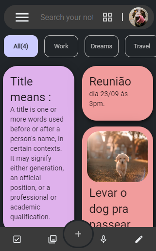

# Notes
Bloco de NOtas desenvolvido em React com Typescript !

Você deve seguir dois passos simples para rodar esse projeto na sua máquina : 
1 - VOCÊ DEVE RODAR O 'npm run server' PARA QUE O SEU SERVIDOR LOCAL JSON ESTEJA FUNCIONANDO NO MOMENTO EM QUE RODAR O FRONTEND
ISSO VAI FAZER COM QUE O PROGRAMA CONSIGA SALVAR LOCALMENTE OS DADOS E PERSISTIR ATRAVES DAS SESSOES DE USUARIO.
2 - VOCÊ DEVE RODAR O COMANDO 'npm run dev' PARA QUE A APLICAÇÃO COMECE A RODAR NA PORTA 5173

